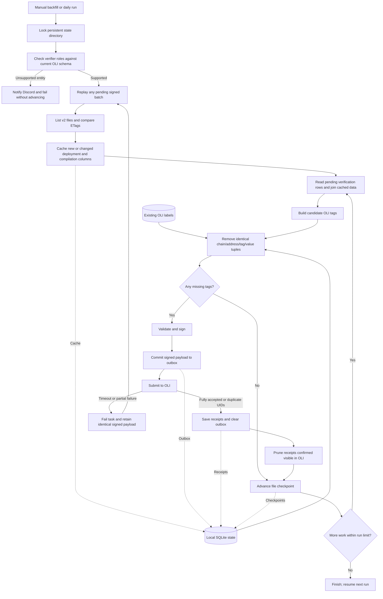

# Verifier Alliance → OLI

`oli_verifier_alliance` runs daily at 06:15 in Airflow's configured DAG timezone
(UTC if the installation uses the default). Its first pass is a resumable
backfill; later passes process only new or changed v2 export files. There is no
January timestamp cutoff: missing older labels are eligible too.

## Workflow



This is the live path. Dry runs perform the same schema gate, cache dimensions and
calculate missing-tag counts; they skip Discord, replay, signing, submission,
receipt pruning, and verification checkpoints.

## Ten real example contracts

[Full candidate payloads for 10 contracts](verifier_alliance_sample_10.json) were
generated from the first ten distinct deployments in the public v2 verification
export on 2026-10-02 using the adapter's `make_label` function. These are unsigned,
**before OLI deduplication**, and were not submitted. Existing OLI labels were not
queried for this preview. All ten have Sourcify verification and Solidity source.
The sample is sequential, not representative of the whole dataset, and includes
testnets because the current importer has no mainnet filter.

| Chain ID (EIP-155) | Contract | Address |
|---|---|---|
| 84532 | DelegationsHoster | `0x0d98bc5baba59abc896c7015bfff16f476a3e0f3` |
| 17000 | Counter | `0x0ed7fe236dbd7aea5818bd077c43402ce8e42615` |
| 17000 | Counter | `0xc6e513a492f2ce35571db70c2883d5ebbb7730ee` |
| 17000 | Counter | `0xd4ad23b3aa5b039b110e63f8e641051779ac38b0` |
| 97 | MultiSigIssuance | `0xbe402364e3cc3d5ca73dbda2cdf9681352867712` |
| 8453 | Storage | `0xdd738a58551f2241513cb4b29e807d0c746c8dbe` |
| 137 | MintBurnTeamToken | `0x720ddd4d206817ccf287213a583060f368568ccb` |
| 80002 | BurnMintERC677 | `0xb365037fcb11da32ffa28dfb99b0ce5852a07777` |
| 17000 | Counter | `0x9507f6e9f27036faf4aef5409372f0b0ece211fc` |
| 1 | DEXIndex | `0xfed026fc243d5de9cc11e9822de25d2e60e0c2db` |

Each JSON entry includes the eight substantive tags and `_source`/`_comment`.
The comment is a JSON-encoded string, as required by OLI's string-valued tag.
Actual submissions contain only the missing substantive values plus provenance;
`source_code_verified` is always included when any new attestation is needed,
even when that particular value already exists. If every value exists, no
attestation is made.

### Example verified by Blockscout

[Complete Blockscout candidate payload](verifier_alliance_sample_blockscout.json):
`SolvBTCOracle` at `0xc3e276c036794bfcf6a1d6253a95a8e56fe729e3`, chain
`eip155:1868`. This was joined directly from the public export on 2026-10-02:
verification ID `45131`, `created_by="blockscout"`, verification time
`2025-02-19 06:31:47.567933`. Runtime and runtime metadata match; creation bytecode
does not match. The adapter emits `source_code_verified="blockscout"` and retains
those distinctions in `_comment`. This is an unsigned candidate before OLI
deduplication and has not been submitted.

### Routescan: accepted by OLI's enum

[Three complete Routescan candidates](verifier_alliance_sample_routescan.json)
were validated against the published OLI tag schemas on 2026-10-02 after
`routescan` was added to the enum. They remain unsigned candidates before OLI
deduplication and have not been submitted. All are on
`eip155:43114`:

| Name | Address | Verification ID |
|---|---|---:|
| StrategyPngSnobPngLp | `0x4bcfb10465a8d22f0a047df3afa8ee06cbcc8e13` | 94756 |
| PangolinRouter | `0x7ecdd54f6a17eb92c0166ad43a73d58ffc3d6c4e` | 94757 |
| SporeMarketv1 | `0xc2457f6eb241c891ef74e02ccd50e5459c2e28ea` | 94760 |

A scan of `created_by` across all 44 listed verification files on 2026-10-02 found
33,333,132 Sourcify, 7,033,354 Blockscout and 3,368,769 Routescan verification rows.
Routescan was the only additional identity in that snapshot. These are counts of
verification records, not necessarily unique contracts. No labels were submitted
and no live Discord webhook was called during sample collection.

## Persistent storage and S3/Hetzner

`VERIFIER_ALLIANCE_STATE_DIR` contains an active SQLite database, not just disposable
downloaded files. Its dimensions can be rebuilt, but losing checkpoints causes
rescans, losing receipts weakens deduplication during indexing delays, and losing
the outbox loses the exact signed payload needed to retry an uncertain submission.

| Storage | Suitable for current implementation? |
|---|---|
| Persistent local disk | Yes; retain across worker/container replacement. |
| Hetzner Cloud Volume attached to one worker | Yes; mount a normal filesystem and point the variable there. |
| S3 / Hetzner Object Storage | For consistent backups; not directly as the live SQLite path. No backup upload is implemented yet. |
| Storage Box over SMB/NFS, or an S3 filesystem mount | Avoid for the active SQLite database; locking/durability semantics differ. |

Hetzner [Volumes are block storage](https://docs.hetzner.com/cloud/volumes/overview/),
whereas its [Object Storage is S3-compatible](https://docs.hetzner.com/storage/object-storage/faq/general/).
SQLite documents the [risks of opening databases over network filesystems](https://www.sqlite.org/useovernet.html).
For backups, use the [SQLite backup API](https://www.sqlite.org/backup.html), or
copy the database while the sync is stopped and the connection is closed. Do not
upload an ordinary file copy while the database is being modified.

A periodic S3 backup is disaster recovery, not a substitute for durable local
outbox commits: restoring an older snapshot may lose submissions made after that
snapshot. Downloading/uploading the entire state once per DAG run would have the
same gap and move a large file every day. A design where workers are disposable
would be better served by a transactional PostgreSQL outbox/checkpoints/receipts,
with rebuildable cache data in object storage. That refactor is not implemented.

### Enforced storage budget

The VM has 300 GB available, but this importer must remain below 100 GB in
permanent storage. The adapter now enforces the following (decimal GB):

- **90 GB database hard cap:** `PRAGMA max_page_count` is applied on every connection,
  and SQLite rejects a transaction that would exceed it. The application cannot
  configure a larger cap. A capacity failure fails the task and sends Discord;
  it does not advance the failed batch or discard a previously committed outbox.
- **80 GB warning:** once per day during verification processing, notify Discord
  when the database has reached this size.
- **95 GB directory guard:** refuse startup if all files in the dedicated state
  directory already total this much. Keep backups and unrelated files elsewhere.
- **Receipt reconciliation:** at startup and after each verification batch,
  compare bounded pages of receipts with OLI. Delete only exact values confirmed
  visible there. A persisted cursor rotates through unconfirmed receipts so a
  delayed record does not indefinitely hide later ones. A failed OLI read retains
  all affected receipts. There is no age-based expiry.
- **Reuse space:** deleted receipt pages are reused by SQLite. There is no full
  `VACUUM` or local backup copy that doubles permanent storage. The database file
  may remain at its previous high-water size even after pruning.

The indexed deployment/compilation cache is retained for efficient historical
joins. Its expected current size is about 20–30 GB; receipts should now reflect
the not-yet-visible backlog rather than the lifetime of the pipeline. If the
source grows enough to hit the cap, the sync stops and alerts; it does not promise
unlimited ingestion within a fixed budget. Transaction rollback journals are
temporary and removed after commits; the cap is on the database, not all transient
VM disk activity. Already oversized files are not automatically truncated.

### Space estimate, measured 2026-10-02

The export listing indicates approximately 42.40M deployments, 6.66M compilations,
and 43.74M verifications. Counts use the older files' documented full row ranges
plus actual Parquet footer row counts for each mutable tail.

Using the current SQLite schema and serialization on the first 10,000 rows of
each dimension table gave approximately 447 bytes/deployment and 291 bytes/
compilation, including indexes. Extrapolation gives **20.9 GB for dimensions**.
This is a sample-based estimate, not a full import measurement; name lengths and
index utilization vary. Plan roughly **20–30 GB for the cache**.

A separate 80,000-row receipt measurement, using the ten samples' tag lengths
and 10,000 synthetic unique addresses, gave about **214 bytes per tag receipt**:

| Scenario | Estimated SQLite storage, decimal GB |
|---|---:|
| Dimension cache only | 20.9 |
| Each additional 1M newly submitted tag receipts | +0.214 |
| Cache plus 100M new tag receipts | 42.3 |
| Original design retaining eight tags for all 42.4M deployments | 93.6 |

The last row describes the previous permanent-receipt design. It cannot occur
with the current 90 GB cap, and confirmed receipts are now pruned. The January
"20M labels" figure must not be treated as 20M fully covered contracts.
Checkpoints/outbox are comparatively small; no source code or bytecode is stored.
Keep backup snapshots outside the dedicated importer directory and include them
separately in the VM/storage budget.

## Setup and first run

- Install `backend/requirements-new.txt` (OLI SDK 2.x and PyArrow are already listed).
- Set `VERIFIER_ALLIANCE_STATE_DIR` to a persistent directory on the Airflow worker.
  Route this DAG to that worker on multi-worker deployments. Do not use ephemeral
  containers or share the SQLite file across network filesystems. Preserve this
  directory across releases and back it up, especially if an outbox is pending.
- Set `OLI_gtp_pk` to the dedicated importer attester key and
  `OLI_API_KEY`. Existing database credentials must allow reading `public.labels`
  in the **oli** database. Add the importer attester to the appropriate trust list
  separately if its labels should feed trusted views.
- Set `DISCORD_CONTRACTS`, or fall back to `DISCORD_ALERTS`. Live runs require a
  nonempty webhook. Failed webhook delivery fails the task and is retried.
- The DAG is initially paused. Before unpausing, run the command below from the
  deployed `backend/` directory using the worker's Python environment and credentials.
  This avoids enabling live scheduled runs just to execute a dry run.
  Unsupported identities fail preflight before dimension caching. Once the gate
  passes this reads OLI and populates the local dimension cache; it does not sign,
  submit, notify Discord, or advance verification checkpoints. The initial cache covers all compilations
  and deployments and can take substantial time/disk even for a small dry run.
- Run with `{"dry_run": false, "max_batches": 1000}` to backfill up to 500,000
  verification rows per run. Repeat manual runs for faster catch-up, or unpause
  for daily continuation. The same DAG and state handle both phases without races.
  `bounded: true` means the processing limit was reached; `false` means the listed
  snapshot is caught up. The limit does not bound initial dimension caching.

First dry run, while the DAG remains paused:

```bash
python - <<'PY'
import os
from src.db_connector import DbConnector
from src.adapters.adapter_verifier_alliance import sync

db = DbConnector(db_name="oli")
try:
    print(sync(os.environ["VERIFIER_ALLIANCE_STATE_DIR"], db.engine,
               dry_run=True, max_batches=2))
finally:
    db.engine.dispose()
PY
```

After the dry run succeeds, unpause `oli_verifier_alliance` when ready for live
submissions. This can schedule a live run immediately. Manual triggers may use
`{"dry_run": false, "max_batches": 1000}` or a higher limit for faster backfill.
Manual Param overrides require `core.dag_run_conf_overrides_params=True` in Airflow.
Use normal triggers, not Airflow's historical-date backfill command: this adapter
tracks source-file progress itself. At the default 500,000 rows/run, the measured
43.7M-row snapshot takes about 88 successful full-sized runs; 10,000 batches allows
up to 5M rows/run, subject to the task's 20-hour timeout and actual throughput.
Retries resume from committed checkpoints. Keep daily scheduling enabled afterward;
no separate DAG or backfill-to-daily mode switch is needed.

### Run completion message

Every successfully completed live `sync()` invocation sends one short Discord
message through the supplied `notify` callback (already wired in the DAG and the
live standalone script). This includes runs ending at `max_batches`, not just
runs that exhaust the export. Example:

> VERA sync complete: 41 new attestations submitted to OLI; 44,000 verification rows checked. Run limit reached; more work remains.

The `submitted` result counts OLI's API `accepted` responses, including accepted
outbox replay submissions. API `duplicates` are counted separately and excluded
from the new-attestation count. The existing `attestations` count describes
candidate payloads, and `tags` counts substantive values including the required
verifier field; neither is a count of newly discovered addresses.

Counts are per invocation, not accumulated across prior failed attempts. If a
previous request was accepted but its response was lost, a replay is a duplicate
and is not counted as newly accepted in this invocation. Dry runs and failed runs
do not send a success message. A completion-webhook failure is logged and returns
`completion_notification_sent: false`; it does not fail/restart committed ingestion.
Operational blocking alerts retain their existing retry behavior.

## Labels

The importer emits `source_code_verified`, `is_contract`, `contract_name`,
`code_language`, `code_compiler`, `deployment_tx`, `deployer_address`, and
`deployment_block` where known. Compiler values use `compiler-version`, matching
Sourcify's existing labels. The initial importer used `compiler version`; the
deduplication comparison now treats that separator difference as equivalent,
including legacy local receipts, without changing the version or commit hash.
Previously generated JSON samples retain the original formatting.
Chain IDs come directly from the dataset as `eip155:<chain_id>`; this includes
chains outside growthepie's tracked set. Verification creation time is **not** a
deployment date. No ownership, categories, proxy status, or token standards are
inferred from source code.

Some public export rows represent unknown deployers as empty bytea (`0x` after
caching) and unknown deployment blocks as `-1`. These optional fields are omitted
from labels instead of aborting the batch. Invalid optional deployer/transaction
hex and non-integral or non-finite block numbers are also omitted; their original
values are retained in `_comment.omitted_deployment_fields` for inspection when
an attestation is emitted. Valid fields, including the verifier, are retained.
The contract address itself remains mandatory and strictly validated. Existing
cached rows require no migration or re-download for this handling.

`_source` links to Verifier Alliance. `_comment` records verification ID, verifier
role, creation timestamp, compilation/deployment IDs, and creation/runtime and
metadata match flags. These provenance tags accompany new substantive labels;
they do not trigger re-attestation by themselves. ABI, source files, bytecode,
compiler settings and transformation payloads are not copied into OLI: they lack
standard label tags and remain accessible through the source dataset.

Every attestation must contain `source_code_verified`. The importer reads the
allowed values from OLI's current tag definitions (SDK on live runs, official YAML
on dry runs), rather than freezing the three current values in code. Preflight
reads only `created_by` for pending verification files and caches those role sets
by ETag. Unknown roles cause a Discord notification and **fail the whole run**
before cache construction, outbox replay, or new attestations. No records are
skipped or marked complete. Alerts for the same unknown set are throttled to
once per 24 hours after successful delivery; dry runs log and fail without Discord.

The published schema now lists `sourcify`, `blockscout`, `etherscan`, and
`routescan` (verified directly on 2026-10-02). The preflight accepts all three
identities found in the export snapshot without an adapter edit, alias, or cursor
reset. A fresh DAG task loads the updated definitions. Future unsupported entities
still block the run and trigger the notification described above.

Optional `VERIFIER_ALLIANCE_VERIFIERS` is a JSON mapping of confirmed role aliases
to the **same entity's** schema-approved name. Exact matches work without it.
Never map Routescan to Sourcify, Etherscan, or another entity to bypass the gate.
If mappings change for already processed records, replay those files by deleting
only their verification checkpoint rows while paused (retain all other state):

```sql
DELETE FROM files WHERE key LIKE 'v2/verified_contracts/%';
```

## Overall scanning progress

The startup and per-batch progress logs include `overall_scanned`, `total_rows`,
`remaining_rows`, and `progress_pct`. `scanned` still counts only rows checked in
the current invocation; `overall_scanned` includes committed verification
checkpoints from earlier runs using the same state directory. For example,
`overall_scanned: 1000000, total_rows: 40000000, progress_pct: 2.5` means 2.5% of
the current export snapshot has been checked. These are verification rows, not
unique addresses or new attestations.

Exact totals come from Parquet footer metadata, including the partially filled
last file. Counts are cached by file ETag in a small SQLite table; this does not
download full export files or add a large storage requirement. A changed file
must be rescanned, so its previous checkpoint stops contributing to progress.
The denominator describes the snapshot listed at startup, not exports added
while the run is active. Dry runs leave cumulative checkpoint progress unchanged.
Completion notifications include the same overall totals and percentage.

Deploy the updated adapter and restart the script/task with the existing state
directory to get these fields. An already running Python process keeps the old
code. No SQLite reset or manual migration is needed.

## Deduplication and failure recovery

Each batch queries the OLI labels view for existing `(chain, address, tag, value)`
tuples across attesters, including Sourcify. Identical values are skipped; missing
or different values may receive an importer attestation without overwriting other
attesters. This is a value comparison, not a blanket exclusion of contracts that
already have any labels. The OLI database must contain the January upload and be
current. Check its address/chain indexes before a large backfill.

Local receipts prevent repeated submissions while OLI indexing catches up and
deduplicate repeated verifications across files. Before any POST, complete signed
payloads are committed to the local outbox. A timeout or crash replays identical
UIDs, including after partial acceptance. A file cursor advances only after full
acceptance (accepted plus duplicate count). Validation errors fail the task and
retain the outbox; inspect the error rather than deleting an uncertain submission.
Older outboxes without a valid `source_code_verified` now fail and alert, rather
than being replayed blindly. Reconcile their signed UIDs against OLI before any
manual repair; an ambiguous previous submission must not simply be re-signed.

File ETags detect rewrites, including the growing final file. Each Parquet range
request uses `If-Match`; a concurrent export rewrite fails safely and is retried.
Changed files are rescanned and deduplicated. No global maximum ID is used, so
late rows with lower IDs are not lost. Missing join dependencies fail without
advancing the affected batch and can resolve after the next export.

The database is capped and confirmed receipts are removed; RAM is bounded by
Parquet column/row-group decoding and batch size. Source/bytecode columns are never
downloaded. The source is append-only; this importer does not discover or propagate
later revocations. Once a receipt is pruned, future deduplication relies on OLI's
current labels view; replaying a file can reissue a value no longer present there.

References: [export format](https://verifieralliance.org/docs/download/),
[database schema](https://github.com/verifier-alliance/database-specs/blob/master/database.sql),
[OLI tags](https://github.com/openlabelsinitiative/OLI/blob/main/1_label_schema/tags/tag_definitions.yml).
